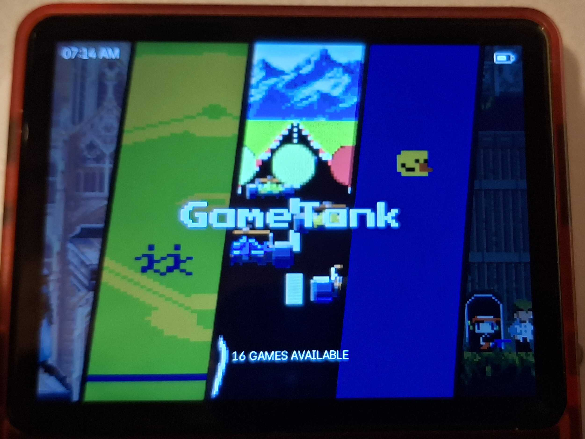

# darkos-es-art-book-next-4x3

Before to begin, thanks to; 

> previous version: https://github.com/mute-key/arkos-es-art-book-next-4x3

## Introduction

The original theme by mute-key this is based on was awesome but I found it started to lack systems under dArkOS and the original repo was locked, so I opted to fork it and push some updates as I do them on my own fork! I will continue to update this page and the theme when I get time but cc licence and credits are already in place as per the source I forked from!

## Preview 

## Changes from previous theme

Added so far

* New Systems
  - GameTank
  - Vircon32

## **Acknowledgments**
* Previous version from: https://github.com/mute-key/arkos-es-art-book-next-4x3
* Original theme : https://github.com/anthonycaccese/art-book-next-jelos
* Referenced Theme :  https://github.com/nkahoang/es-theme-art-book-next-arkos
* Referenced Theme :  https://github.com/Jetup13/es-theme-sagaartbook
* Most system logos were sourced and modified from the excellent work done by Dan Patrick [here](https://archive.org/details/console-logos-professionally-redrawn-plus-official-versions).  Modified by Mute key so each will be compatible with EmulationStation's current SVG support.
* Newly added system logos created by me.
* ChangaOne font is by [Eduardo Tunni](https://www.fontsquirrel.com/fonts/changa)
* Oxygen font is by [Vernon Adams](https://www.fontsquirrel.com/fonts/oxygen)
* Auto-Collection Genre background art created by [@nautipuss](https://github.com/nautipuss)
* Metadata Icons sourced from [FontAwesome](https://fontawesome.com/search?o=r&m=free)

## **License**
(Attribution back to the OG repo by `anthonycaccese`: https://github.com/anthonycaccese/art-book-next-es)
Creative Commons CC-BY-NC-SA - https://creativecommons.org/licenses/by-nc-sa/2.0/
You are free to share and adapt this theme as long as you provide attribution back to me (and the above credits) as well share any updates you make under the same licence terms.
